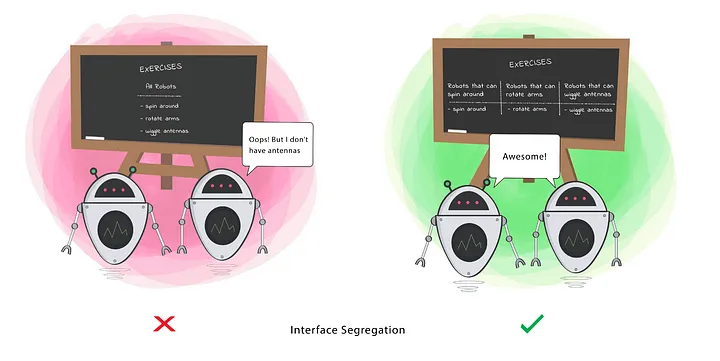

# Segregation Principle

When a Class is required to perform actions that are not useful, it is wasteful and may produce unexpected bugs if the Class does not have the ability to perform those actions.

A Class should perform only actions that are needed to fulfil its role. Any other action should be removed completely or moved somewhere else if it might be used by another Class in the future.

**This principle aims at splitting a set of actions into smaller sets so that a Class executes ONLY the set of actions it requires.**

